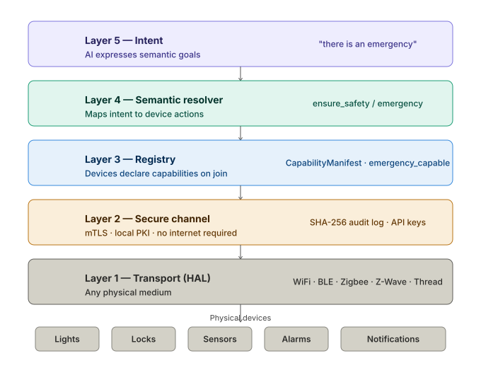

# DoSync Protocol

> The protocol that acts when it matters most.

[](LICENSE)
[](spec/DOSYNC-SPEC-v0.1.md)
[](certify.py)
[](dosync/mcp_server.py)

---

## The problem

Today's smart home protocols speak the language of commands. AI speaks the language of goals.

```python
# Existing protocols
lock.unlock()
light.set_brightness(100)
thermostat.set_temperature(21)

# What an AI actually expresses
"there is an emergency at home"
"nobody is home — save energy"
"good morning"
```

Someone has to translate. Today, that translation is custom code written per-device, per-platform, per-scenario. It breaks when you add a new device. It completely fails in emergencies where milliseconds matter.

**DoSync is the bridge.**

---

## What it does

DoSync is an open communication protocol (Apache 2.0) that lets AI systems interact with physical devices using **semantic intent** — expressing *what they want to achieve*, not *how to achieve it*.

When the hub receives `"ensure_safety / emergency"`, every registered device figures out its own role automatically based on its declared capabilities — no hardcoded rules, no manual configuration.

---

## Demo

[](https://youtu.be/2czAqoIrd08)

**What you'll see:** A natural language conversation with Claude AI triggers a physical emergency protocol in real time — 10 Philips WiZ bulbs at full brightness, SMS notification sent, audit log updated. No commands. No rules. No cloud.

---

## How it works

```
User / AI says:  "there is an emergency at home"
                          │
                    DoSync Hub
                          │
          ┌───────────────┼───────────────┐
          ▼               ▼               ▼
   💡 All lights      📱 SMS sent     🚨 Alarm
   at maximum       to family        activated
   (10 WiZ bulbs)   immediately
          │               │               │
          └───────────────┴───────────────┘
                          │
                  Audit log updated
              (SHA-256 tamper-evident)
```

The **Semantic Resolver** matches the intent against every device's **Capability Manifest** — what it can sense, what it can do, whether it's emergency-capable. No rules to write. Add a new device and it participates automatically.

---

## Protocol architecture



| Layer | Name | Role |
|-------|------|------|
| 5 | **Intent** | AI expresses semantic goals |
| 4 | **Semantic** | Resolver maps intent → device actions |
| 3 | **Registry** | Devices self-declare capabilities on join |
| 2 | **Secure channel** | mTLS, local PKI — no internet required |
| 1 | **Transport (HAL)** | WiFi · BLE · Zigbee · Z-Wave · Thread |

---

## Quick start

### Option A — Docker (recommended, no setup required)

```bash
git clone https://github.com/giulianireg-spec/dosync-protocol
cd dosync-protocol
docker compose up
```

That's it. The hub starts, 8 simulated devices register automatically, and the dashboard is live at **http://localhost:47200**. No hardware required.

### Option B — Local Python

```bash
git clone https://github.com/giulianireg-spec/dosync-protocol
cd dosync-protocol
python3 -m venv venv && source venv/bin/activate
pip install -r requirements.txt

# Start the hub
PYTHONPATH=. uvicorn server:app --host 0.0.0.0 --port 47200 --reload

# In a second terminal — register simulated devices
python3 demo_seed.py

# Open the dashboard
open http://localhost:47200

# Run the full demo (7 scenarios)
PYTHONPATH=. python3 examples/demo_full.py

# Run certification suite
python3 certify.py --host localhost --port 47200 --tier emergency
```

---

## What's built today

| Component | Status |
|-----------|--------|
| REST API (12+ endpoints) | ✅ |
| WebSocket real-time events | ✅ |
| Web dashboard | ✅ |
| API key authentication + SHA-256 audit log | ✅ |
| Semantic resolver (7 intent classes) | ✅ |
| Certification CLI — 16/16 tests | ✅ |
| Philips WiZ adapter (UDP local) | ✅ |
| Home Assistant bridge (10 domains) | ✅ |
| Native MCP server (Claude, ChatGPT, any LLM) | ✅ |
| GPIO adapter — Raspberry Pi 5 (PIR + DHT22) | ✅ |
| SMS notifications via Twilio | ✅ |
| Device discovery (UDP broadcast) | ✅ |
| SQLite persistence (survives restarts) | ✅ |

---

## MCP integration

DoSync ships a native MCP server. Any LLM with MCP support can control the hub directly — no extra configuration.

```json
{
  "mcpServers": {
    "dosync": {
      "command": "python3",
      "args": ["/path/to/dosync/dosync/mcp_server.py"],
      "env": {
        "DOSYNC_HUB_URL": "http://localhost:47200",
        "DOSYNC_TOKEN": "<your-token>"
      }
    }
  }
}
```

Once connected, you can say:

> *"Turn off all the lights"*  
> *"There is an emergency at home"*  
> *"Nobody is home — save energy"*

And the hub executes the full protocol in real time.

---

## Hardware demo

Tested with:
- **Raspberry Pi 5** — runs the hub autonomously 24/7
- **Philips WiZ** — 10 bulbs controlled via UDP local network
- **PIR HC-SR501** — motion detection → emergency intent
- **DHT22** — temperature/humidity sensor → anomaly detection

```
Motion detected (PIR on Raspberry Pi)
    → ensure_safety [emergency] fired
        → 10 WiZ bulbs at full brightness
        → SMS sent to family
        → Audit log updated
All in under 100ms. No internet. No cloud.
```

---

## Adapters

DoSync uses a pluggable adapter system. Adding support for a new device requires implementing a single method:

```python
class MyAdapter(DoSyncAdapter):
    async def execute(self, action: DeviceAction, urgency: Urgency) -> ActionResult:
        # translate DoSync action to device-native protocol
        ...

    @property
    def adapter_name(self) -> str:
        return "myadapter"
```

**Available today:** `wiz` · `homeassistant` · `gpio` · `simulated`  
**Planned:** `shelly` · `matter` · `ble` · `zigbee2mqtt`

---

## Certification

Three tiers — self-certifiable with the CLI:

| Tier | Requirements |
|------|-------------|
| **Basic** | Connects, authenticates, publishes capability manifest |
| **Standard** | Responds to intents, sends events |
| **Emergency** | Emergency override + tamper-evident SHA-256 audit log |

```bash
python3 certify.py --host <device-ip> --port 47200 --tier emergency
# Output: dosync-cert.json — signed certification report
```

---

## Repository structure

```
dosync-protocol/
├── dosync/
│   ├── models.py              # Core types — Intent, Manifest, ActionPlan
│   ├── hub.py                 # Semantic resolver + capability registry
│   ├── executor.py            # Device executor abstraction
│   ├── db.py                  # SQLite persistence
│   ├── auth.py                # API key authentication
│   ├── discovery.py           # UDP device discovery
│   ├── mcp_server.py          # Native MCP server
│   └── adapters/
│       ├── wiz.py             # Philips WiZ (UDP)
│       ├── homeassistant.py   # Home Assistant bridge
│       └── notifications.py   # SMS via Twilio
├── server.py                  # FastAPI hub — REST + WebSocket
├── dashboard.html             # Real-time web dashboard
├── certify.py                 # Certification CLI
├── discover.py                # Device discovery CLI
├── ha_bridge.py               # Home Assistant import CLI
├── gpio_adapter.py            # Raspberry Pi GPIO adapter
├── manage.py                  # Key and DB management CLI
├── examples/
│   └── demo_full.py           # 7-scenario demo
└── spec/
    └── DOSYNC-SPEC-v0.1.md    # Full protocol specification
```

---

## Not just for the home

DoSync's architecture is domain-agnostic. The same 5-layer stack works anywhere an AI needs to act on physical systems:

- **Hospital** — "prepare OR 3 for emergency" → equipment, lighting, access coordinated
- **Hotel** — "guest in 412 has arrived" → room configured to saved preferences
- **Factory** — "line B failure" → safe shutdown, notifications, audit trail
- **Smart building** — energy, security, access — orchestrated by intent

The protocol is the infrastructure. The domain is up to you.

---

## Specification

Full protocol specification: [spec/DOSYNC-SPEC-v0.1.md](spec/DOSYNC-SPEC-v0.1.md)

---

## License

Apache 2.0 — free to implement, free to extend, no royalties.

---

*DoSync Protocol v0.1 · © 2026 Rodrigo Giuliani · giulianireg@gmail.com*
